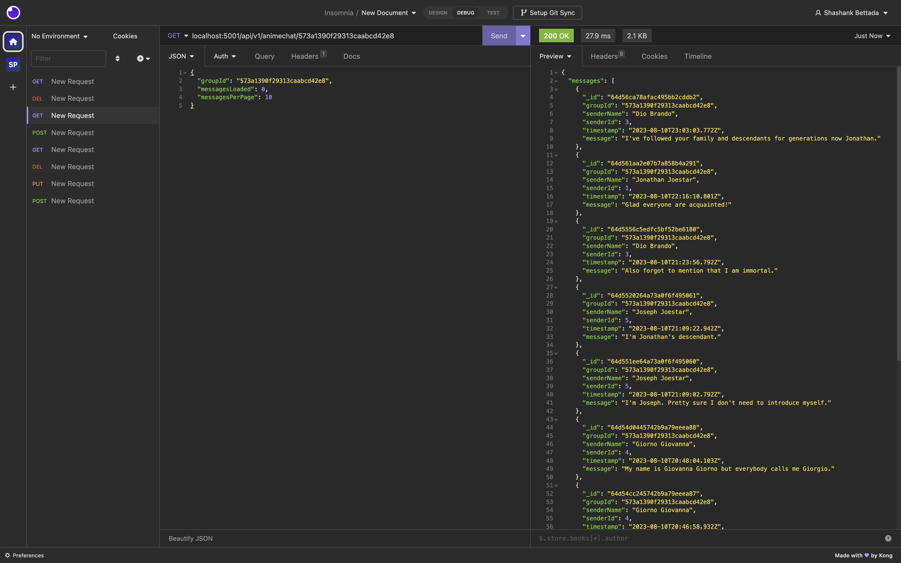
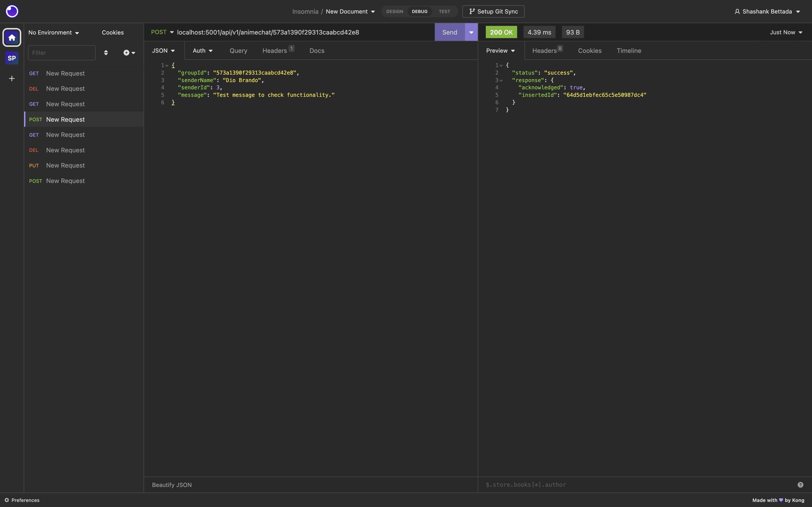
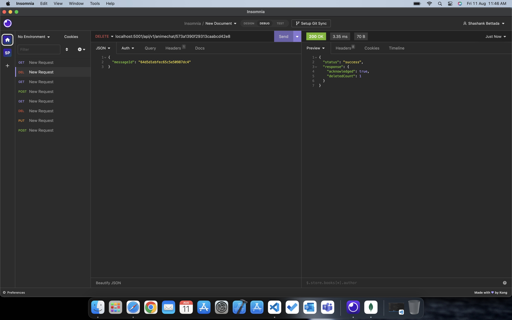

# CS5610 Su23 Project Backend

App name: AnimeChat

App Summary:

A platform where users can chat about their favorite Anime. Each Anime has its dedicated channel where users can post their thoughts and be involved in discussions with others who are online. 

App link: https://animechat-frontend-shashankbs.uw.r.appspot.com

## Iter2:

### Progress

For this iteration, I worked on the backend CRUD APIs.

1. The GET api is used to fetch a batch of 10 most recent messages. When the user chooses to 'load more', 10 more messages are fetched in the descending order of their timestamp. 

In the below screenshot, I have fetched the 10 most recent messages from the group with a groupId - 573a1390f29313caabcd42e8.

2. The POST api is used to post a new message into a group chat.

In the below screenshot, I have posted a message to the group whose groupId is: 573a1390f29313caabcd42e8.

3. The DELETE api is used to delete a message from a group.

In the below screenshot, I have deleted a message (messageId: 64d5d1ebfec65c5e50987dc4) from the group whose groupId is: 573a1390f29313caabcd42e8.

### Issues/Concerns:

Although working as expected with my localhost:5001 endpoints, when deployed to Google Cloud the app's apis are not returning the desired results. I will shortly make a Piazza post explaining the issue to the Professor and the TAs.